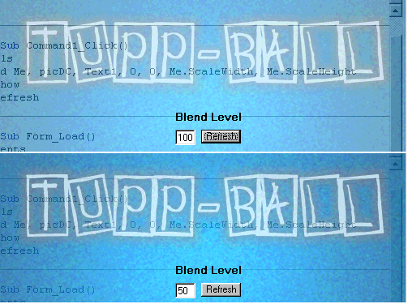



## Semi\-Transparent Form

### Description

This demonstrates the use of alpha blending to create the illusion of a semi-transparent form. This effect can be used to make some VERY COOL form closing effects.
 
### More Info
 

             |
---                |---
**Submitted On**   |2000-05-07 02:26:58
**By**             |[Kevin Tupper](https://github.com/Planet-Source-Code/PSCIndex/blob/master/ByAuthor/kevin-tupper.md)
**Level**          |Intermediate
**User Rating**    |4.0 (24 globes from 6 users)
**Compatibility**  |VB 5\.0, VB 6\.0
**Category**       |[Custom Controls/ Forms/  Menus](https://github.com/Planet-Source-Code/PSCIndex/blob/master/ByCategory/custom-controls-forms-menus__1-4.md)
**World**          |[Visual Basic](https://github.com/Planet-Source-Code/PSCIndex/blob/master/ByWorld/visual-basic.md)
**Archive File**   |[CODE\_UPLOAD5573572000\.zip](https://github.com/Planet-Source-Code/kevin-tupper-semi-transparent-form__1-7924/archive/master.zip)

